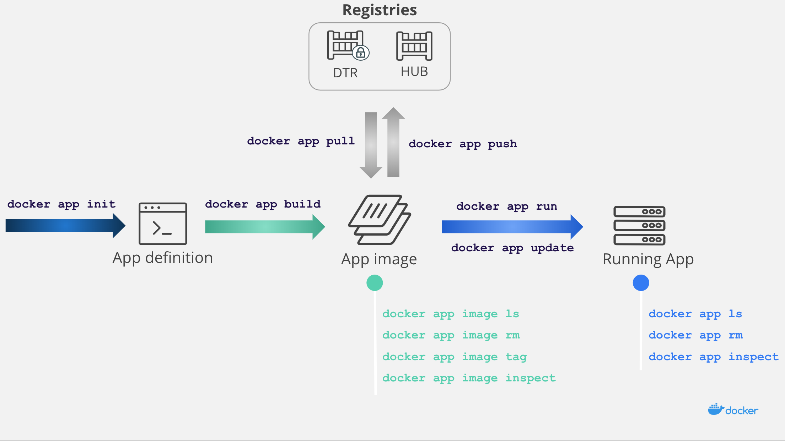

# Docker App

Docker App is a Cloud Native application packaging framework with which developers and devops can  build, share, and run a set of microservices as a single entity. Docker Apps are based on the [Compose format](https://docs.docker.com/compose/compose-file/), which permits [docker-compose](https://github.com/docker/compose) users to easily share their Compose-based multiservice applications via container registries. By leveraging containers, Docker App makes it possible to easily change parts of the application and to share the application through container registries.

### Table of Contents
- **[What are the benefits offered by Docker App?](#what-are-the-benefits-offered-by-docker-app)**
- **[How does Docker App work?](#how-does-docker-app-work)**
- **[Using Docker App](#using-docker-app)**
    * **[Writing an App definition](#writing-an-app-definition)**
    * **[Building an App image](#building-an-app-image)**
    * **[Sharing the App on the Hub](#sharing-the-app-on-the-hub)**
    * **[Running the App](#running-the-app)**
- **[Example](#example)**
    * **[App definition](#app-definition)**
    * **[Using parameters](#using-parameters)**
    * **[Building an App image](#building-an-app-image)**
    * **[Sharing and running the App](#sharing-and-running-the-app)**
- **[CNAB](#cnab)**
- **[Installation](#installation)**
    * **[Linux or macOS](#linux-or-macos)**
    * **[Windows](#windows)**
- **[Next steps](#next-steps)**

## What are the benefits offered by Docker App?

* Simple management of Docker Apps across different teams and between different environments (Development/QA/Staging/Production)
* Easy sharing of multi-service applications to container registries (e.g., [Docker Hub](https://hub.docker.com/) or [Docker Trusted Registry](https://docs.docker.com/ee/dtr/))
* Having a clear separation of parameters to be modified at runtime 
* Support for multiple orchestrators (Swarm or Kubernetes)
* Provides the very same UX flow as the one for Docker images
* Implements the [CNAB](https://cnab.io) industry standard
* Offers full support for Docker Contexts

## How does Docker App work?

The Docker App workflow is quite similar to the Docker image workflow. From an App definition, you can build an App image, share it on Docker Hub, and run your App on an orchestrator.



## Using Docker App

Four primary steps comprise the Docker App process:
1. Writing an App Definition
1. Building an App Image
1. Sharing the App on the Hub (optional)
1. Running the App

### Writing an App definition

The first step in using Docker App is to write the App definition. This definition can be created (1) from an existing [Compose file](https://docs.docker.com/compose/compose-file/) using the `docker app init` command (2) via  a template from the [Application Designer](https://docs.docker.com/ee/desktop/app-designer/), or (3) from scratch. 

The App definition is a .dockerapp folder that contains three distinct pieces: metadata, a service list, and the parameters. 

| File | Description |
| :------------ | :------------ |
| metadata.yml | metadata including the App name and version |
| docker-compose.yml | Service list defined in a Compose file |
| parameters.yml | Parameters that can be changed when running the App |

*Note: To store additional files in Docker Apps, such as `prod.yml`, `test.yml` or other config files, you need only to add these files to the *.dockerapp directory. All files will be packaged into the App image through the use of the `docker app build`  command.*

### Building an App image

Once the App definition is written, the next step is to build the App image from the App definition using the `docker app build` command. With this command you can tag your App image, set build-time variables, or make the build quiet. 

Note that service images inside of an App image are immutable, meaning that the App version ties to a fixed list of service images (i.e., updating the images inside of a Docker App requires rebuilding the App image). This makes deploying applications more deterministic.

### Sharing the App on the Hub

You can push any App image already built or pulled to Docker Hub (or any [OCI compliant registry](https://www.opencontainers.org)) using the `docker app push` command. You can also pull App images from any OCI compliant registry using the `docker app pull` command.

When pushing an App image, all the service images used by the application are pushed at the same time inside a single entity. The version of each service image is resolved at build time from its tag.

### Running the App

The final Docker App step is to actually run your App using the `docker app run` command. You can either pick up an App image from Docker Hub or one that you built locally and deploy it to Swarm or Kubernetes.

## Example

Using the [hello-world](./examples/hello-world) application example, we are going to build, share, and run a Docker App that launches an HTTP server that prints the text variable value when hit on the configured port. 

*Note: Before starting, confirm that the Docker App CLI plugin is [installed](#installation) on your machine*

### App definition

First, create an App definition from an existing Compose file.

Create a `docker-compose.yml` file that has the following content: 

```yaml
version: '3.6'
services:
  hello:
    image: hashicorp/http-echo
    command: ["-text", "hello world"]
    ports:
      - 5678:5678
```

Next, create an App definition using the `docker app init` command:

```shell
$ docker app init --compose-file docker-compose.yml hello
Created "hello.dockerapp"
$ tree
.
├── docker-compose.yml
├── hello.dockerapp
    ├── docker-compose.yml
    ├── metadata.yml
    └── parameters.yml
```

A new folder named `hello.dockerapp` now exists, which contains three YAML documents:
* metadata
* a Compose file
* parameters for your application to be used at runtime

The `metadata.yml` file should display as follows:

```yaml
version: 0.1.0
name: hello
description: A simple text server
maintainers:
- name: yourusername
  email:
```

The Compose file is the one that was passed in parameters. Thus, if you open `parameters.yml` you will notice that it is empty, as the Compose file isn’t using any variable.

### Using parameters

Edit the `docker-compose.yml` file in the `hello.dockerapp` directory to add some variables:

```yaml
version: '3.6'
services:
  hello:
    image: hashicorp/http-echo
    command: ["-text", "${text}"]
    ports:
      - ${port}:5678
```

Next, define the default values for the App in the `parameters.yml` file:

```yaml
port: 5678
text: hello development
```

### Building an App image

Next, build an App image:

```shell
$ docker app build . -f hello.dockerapp -t myrepo/hello:0.1.0
[+] Building 0.7s (6/6) FINISHED
(...) (Build output)
sha256:4a492748ae55170daadd1ddfff4db30e0ef3d38bf0f57a913512caa323e140de
```                                                                              

At this point, an App image with the `myrepo/hello:1.0.1` tag has been built from the `hello.dockerapp` App definition. This immutable App image includes all the service images at fixed versions that you can run or share.

### Sharing and running the App

To share your App image, push it to a container registry.

```shell
$ docker app push myrepo/hello:0.1.0
```  

Now run your App:

```shell
$ docker app run myrepo/hello:0.1.0 
``` 

You can specify the Docker endpoint where an application is installed using a context. By default, your App will run on the currently active context. You can select another context with the `docker context use` command, and the `docker app run` command will thereafter run your app on this particular context. 

Whenever you define such a context, the installer image will run in the default context (i.e., on local host). You can then use the `--installer-context` to target another context to run the installer image.

```shell
$ docker context create remote --description "remote cluster" --docker host=tcp://<remote-ip>:<remote-port>
Successfully created context "remote"

$ docker context ls
NAME                DESCRIPTION                               DOCKER ENDPOINT               KUBERNETES ENDPOINT                ORCHESTRATOR
default *           Current DOCKER_HOST based configuration   unix:///var/run/docker.sock   https://localhost:6443 (default)   swarm
remote              remote cluster                            tcp://<remote-ip>:<remote-port>

$ docker context use remote
$ docker app run myrepo/hello:0.1.0
``` 

## CNAB

Docker Apps are Docker’s implementation of the industry standard Cloud Native Application Bundle (CNAB). [CNAB](https://cnab.io/) is an industry specification put in place to facilitate the bundling, sharing, installing and managing of cloud-native apps that are not only made up of containers but also from such things as hosted databases, functions, etc. 
Docker App is designed to abstract as many CNAB specifics as possible, to provide users with a tool that is easy to use while alleviating the need to bother with the CNAB specification.

## Installation

Docker App is a *command line* plugin (not be confused with *docker engine plugins*) that extends the `docker` command with `app` sub-commands. It requires [Docker CLI](https://download.docker.com/) 19.03.0 or later, with experimental features enabled. Either set environment variable `DOCKER_CLI_EXPERIMENTAL=enabled` or update your [docker CLI configuration](https://docs.docker.com/engine/reference/commandline/cli/#experimental-features).

*Note: The* `docker plugin install` *command cannot be used to install Docker-app.*

### Linux or macOS

Download your OS tarball:
```shell
export OSTYPE="$(uname | tr A-Z a-z)"
curl -fsSL --output "/tmp/docker-app-${OSTYPE}.tar.gz" "https://github.com/docker/app/releases/download/v0.8.0/docker-app-${OSTYPE}.tar.gz"
tar xf "/tmp/docker-app-${OSTYPE}.tar.gz" -C /tmp/
```

Install as a Docker CLI plugin:
```shell
mkdir -p ~/.docker/cli-plugins && cp "/tmp/docker-app-plugin-${OSTYPE}" ~/.docker/cli-plugins/docker-app
```

### Windows

Download the Windows tarball:
```powershell
Invoke-WebRequest -Uri https://github.com/docker/app/releases/download/v0.8.0/docker-app-windows.tar.gz -OutFile docker-app.tar.gz -UseBasicParsing
tar xf "docker-app.tar.gz"
```

Install as a Docker CLI plugin:
```powershell
New-Item -ItemType Directory -Path ~/.docker/cli-plugins -ErrorAction SilentlyContinue
cp docker-app-plugin-windows.exe ~/.docker/cli-plugins/docker-app.exe
```

## Next steps

If you're interested in contributing to the project, jump to
[BUILDING.md](BUILDING.md) and [CONTRIBUTING.md](CONTRIBUTING.md).

Further examples are available in the [examples](https://github.com/docker/app/blob/master/examples) directory.