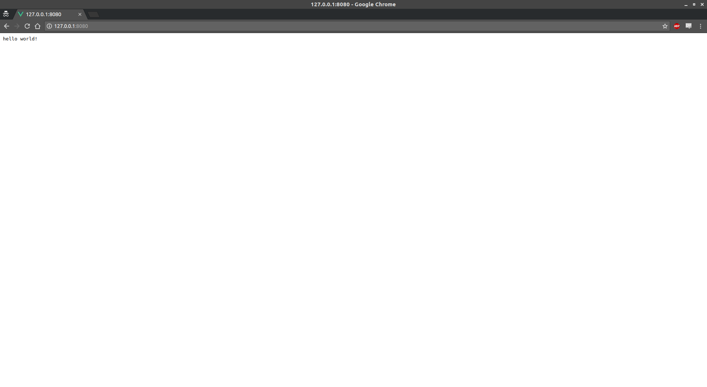
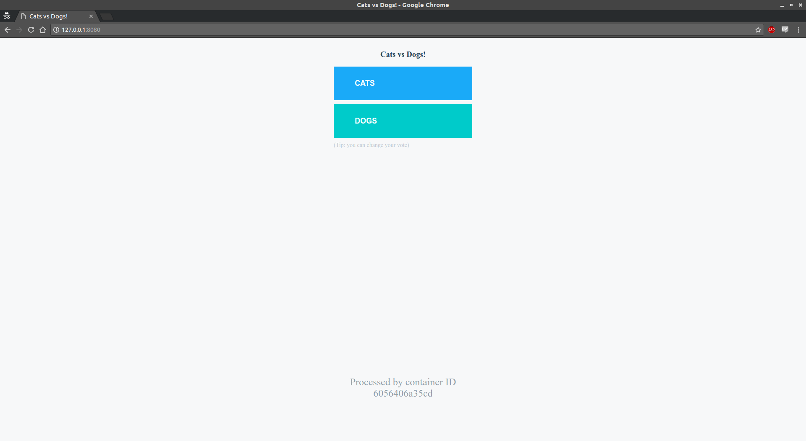
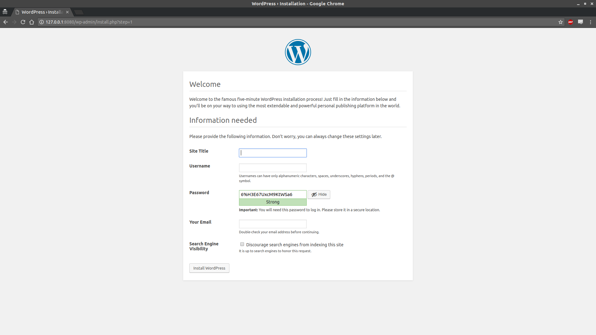

## Examples

This folder contains several examples of applications built using `docker-app`, from a simple `hello-world` application to more complex, multi-service applications.

### Hello world application: [hello world](hello-world)

To learn how to create a simple app that displays a given text.

### Voting application: [voting-app](voting-app)

To learn how to create the Docker voting app from [Docker samples](https://github.com/dockersamples).

### WordPress application: [WordPress](wordpress)

To learn how to create a basic WordPress with a database.

### [CNAB simple application](cnab-simple)

Inspect and bundle a simple application as a [CNAB](https://cnab.io).

### [Deploy a Helm Chart using docker-app](cnab-helm)

As `docker-app` is a [CNAB](https://cnab.io) compliant client, you can deploy any CNAB.
