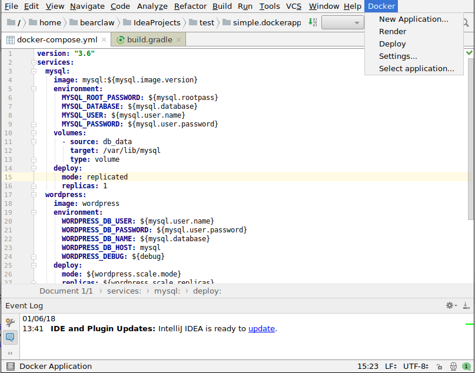

# Docker Application plugin for intellij IDEA

This directory contains the sources of a Docker Application plugin for Intellij IDEA.

The plugin creates a new top-level `Docker` menu populated with commands to manipulate Docker applications.

# Building the plugin

Simply run `./gradlew build` in the plugins/intellij directory. This will create a jar with the plugin binary in the `build/lib` directory.

# Installing the plugin

Follow instructions here: https://www.jetbrains.com/help/idea/installing-plugin-from-disk.html

# Using the plugin

The plugin exposes the following commands in a top-level `Docker` menu:

## New application

This command displays a dialog that can be used to initialize a new Docker Application.

It gives you the option to chose the name, description and maintainers of the application, as well as whether to use single-file mode or not.

## Select application

By default all operations will look for a single Docker Application at the root of the project directory. If your application is located elswhere, or if you have multiple applications, you can use the `select application` menu to select which application will be used.

## Render

`Render` simply renders the application in a popup window.

## Settings

`Settings` pops-up a dialog that can be used to configure deployment parameters, such as which orchestrator to use, the stack name and namespace, and settings overrides.

## Deploy

`Deploy` deploys your application to a cluster. Progress or eventual errors are displayed in the event log.

